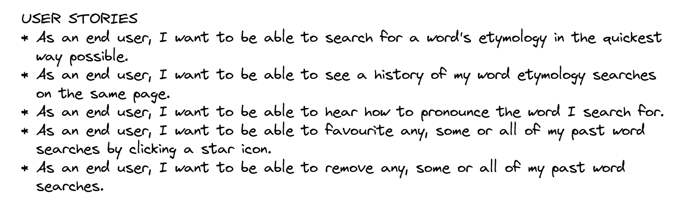

# PROJECT 2: ETYMOLOGY DICTIONARY

## Description
- This project is a web application that allows users to search for the etymology of a given word. Users can also add words manually to their search list, edit existing words in their list, and remove words from their list. The application uses the [Merriam-Webster Collegiate Thesaurus API](https://dictionaryapi.com/products/api-collegiate-thesaurus) to provide the etymology data.

## Deployment Link
- You can access the project here: [Hari's Etymology Dictionary React List App](https://hpramanathan.github.io/project2-reactlist/)

## Getting Start/Code Installation
- The user just needs to load the deployment link above to access the app.

## Timefram and Working Team (Solo)
- We were given 6 days to work on this project on our own.

## Technologies Used
- CODE VERSIONING/CONTROL
  - Git and GitHub
- DEVELOPER TOOLS
  - React, React Router, Windows Subsystem for Linux, Visual Studio Code, Mozilla Firefox and Mozilla Firefox Developer Tools
- WIREFRAME & USER STORIES
  - Excalidraw
- CODING
  - CSS
  - JavaScript
  - JSX

## Planning
- I used Excalidraw to create a basic wireframe of the game console on the webpage.

## Build/Code Process
- I started this project by creating a wireframe and a very brief set of user stories to help me visualize what I wanted to build and what features it would have. I then began coding the main components of the application, including the API search bar and the recent search list. I used React Router to handle the routing between the home page and the under construction list page. 
- I also incorporated CSS styling to create a visually appealing and responsive design.
- One of the biggest challenges I faced during development was figuring out how to handle editing existing words in the search list. I ultimately decided to use a state variable to keep track of whether the user was editing a word or not, and conditionally render the appropriate UI elements based on that state.
- I also struggled with incorporating the Merriam-Webster API, as the data it returns is quite complex. I used the fetch API to make requests to the API and parsed the data using JavaScript's built-in JSON object.
- Overall, the development process was a great learning experience and helped me to gain a deeper understanding of React, React Router, and API integration.

## Unsolved Problems

- One issue that I was unable to fully resolve in this iteration of the project is handling errors that occur when making requests to the Merriam-Webster API. Currently, if an error occurs, the application simply logs an error message to the console. In future iterations, I would like to implement more robust error handling to provide more meaningful feedback to the user.
- Another feature that I would like to add in the future is the ability for users to save their search list for future reference. This would require incorporating some sort of backend server and database to store user data.

## Functionality

- One of my favorite features of this application is the ability for users to add words manually to their search list. This allows users to add an etymology of any word or phrase that is not in the dictionary or even just make up a new word and/or etymology.
- Another feature that I am proud of is the ability for users to edit existing words in their search list. This was a challenge to implement, but I think it adds a lot of value to the application and makes it more user-friendly.

## Conclusion

- Overall, I am pleased with how this project turned out and feel that it was a great learning experience. I enjoyed the challenge of integrating an external API into my application and am excited to continue improving and expanding upon this project in the future.